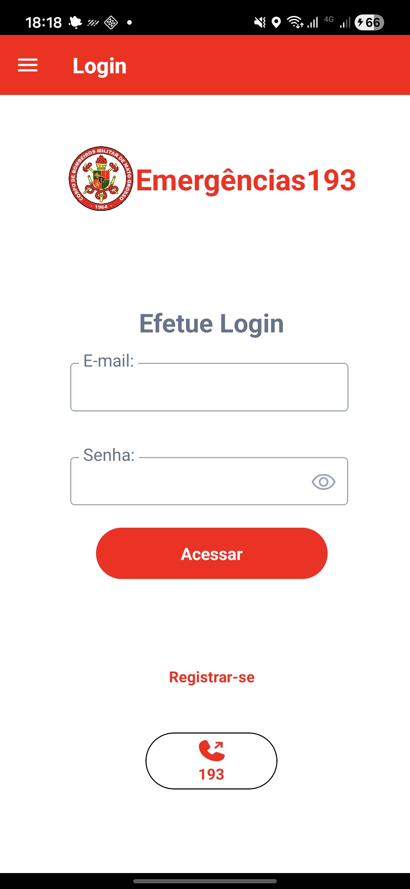
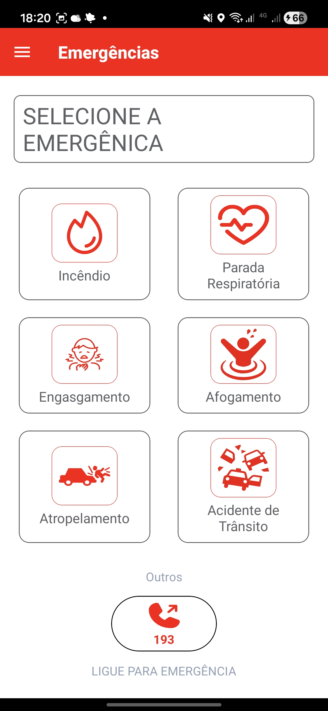
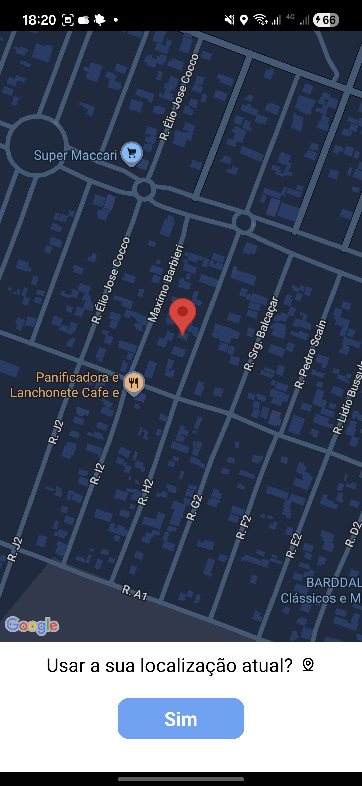
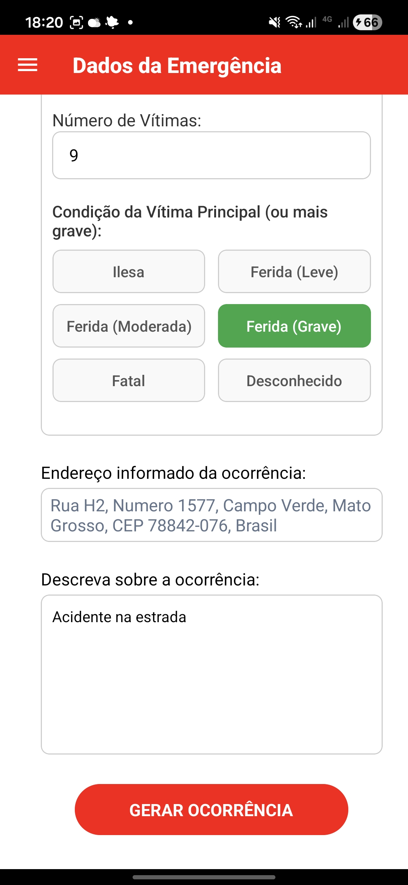

# App193 — Aplicativo de Emergências

Aplicativo mobile que permite ao cidadão de Campo Verde (MT) acionar o **Corpo
de Bombeiros Militar** pelo celular, informando o tipo de incidente e enviando
a localização automaticamente — reduzindo o tempo entre a ocorrência e o
despacho da guarnição.

Trabalho de conclusão do curso de Análise e Desenvolvimento de Sistemas —
IFMT Câmpus Campo Verde. Trabalho reconhecido com **Troféu de Mérito
Estudantil** na 1ª Jornada de Ensino, Pesquisa e Extensão do câmpus, em 2025.

## Telas

A
| Login | Tipos de emergência | Localização | Informações da ocorrência
|---|---|---| ---
|  |  |  | 

## Funcionalidades

- **Cadastro do cidadão** em duas etapas — dados pessoais e, em seguida,
  endereço e telefone, com máscaras de CPF, CEP e telefone
- **Autenticação** com recuperação de senha
- **Acionamento por tipo de ocorrência**: incêndio, afogamento, acidente,
  atropelamento e engasgo
- **Captura automática de geolocalização**, com visualização e confirmação do
  ponto em mapa antes do envio
- **Endereço por geocodificação reversa** — a partir das coordenadas, o app
  preenche rua, bairro e cidade automaticamente
- **Registro de vítimas** — quantidade e condição
- **Acionamento sem localização**, para quando o cidadão nega a permissão de
  GPS ou o sinal falha
- **Armazenamento seguro de credenciais** no dispositivo com Expo SecureStore

## Stack

React Native 0.79 · Expo 53 · React Navigation · react-native-maps ·
expo-location · Expo SecureStore · Biome

## Rodando localmente

Requisitos: Node.js 20+ e o app **Expo Go** no celular.

```bash
git clone https://github.com/HumbertoQueiroz/APP-CBM-CAMPO-VERDE
cd APP-CBM-CAMPO-VERDE
npm install
npx expo start
```

Leia o QR Code com o Expo Go, ou use `npm run android` / `npm run ios` para
abrir em emulador.

### Apontando para outra API

O endereço da API fica no contexto definido em `App.jsx`:

```js
export const ipContext = createContext('cbm-app-6qeks.ondigitalocean.app')
```

Por padrão o app consome a API em produção. Para usar uma instância local,
troque esse valor pelo IP da sua máquina na rede (não use `localhost` — o
celular não enxerga o `localhost` do computador).

## Estrutura

```
App.jsx                     Navegação, contextos de autenticação e de API
src/pages/
  Login.jsx                 Autenticação
  Registrarse.jsx           Cadastro — dados pessoais
  EnderecoTelefone.jsx      Cadastro — endereço e telefone
  RecuperarSenha.jsx        Recuperação de senha
  HomeEmergencias.jsx       Seleção do tipo de emergência
  localizacao.jsx           Captura e confirmação da localização
  dadosEmergencia.jsx       Detalhes da ocorrência e envio
src/components/             Inputs com máscara e funções de armazenamento local
src/assets/                 Ícones das naturezas de ocorrência (SVG)
```

## Decisões de projeto

**Trilha de auditoria imutável.** Toda inclusão grava data e usuário
responsável, e esses campos nunca são alterados — modificações posteriores
gravam em campos próprios. Em um sistema de emergência, o histórico de uma
ocorrência precisa ser reconstituível: quem registrou, quando, e o que mudou
depois.

**Confirmação da localização antes do envio.** O app não despacha a coordenada
do GPS direto. Mostra o ponto no mapa e pede confirmação, porque erro de GPS em
área urbana chega a dezenas de metros — e endereço errado em emergência custa
tempo de atendimento.

**Acionamento não bloqueado pela ausência de GPS.** Se o cidadão nega a
permissão ou o sinal falha, o fluxo continua sem coordenada e apenas com o
endereço digitado. Um app de emergência não pode recusar um chamado por causa
de uma permissão negada.

## Projeto completo

| Camada | Repositório |
|---|---|
| App mobile | este repositório |
| API | [APPCBM-BackEnd](https://github.com/HumbertoQueiroz/APPCBM-BackEnd) |
| Painel web | [AppCbmWeb](https://github.com/HumbertoQueiroz/AppCbmWeb) |

## Histórico

A versão inicial do aplicativo, anterior à integração com a API, está
preservada no branch [`versao-inicial`](../../tree/versao-inicial).
